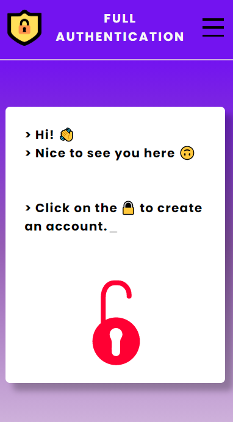
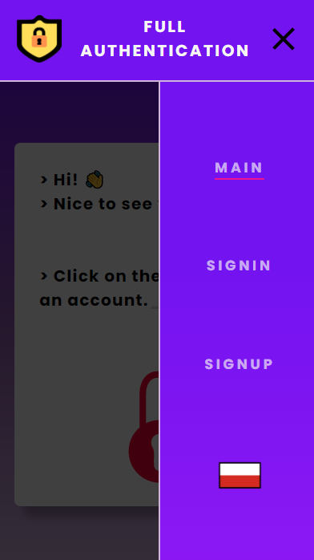
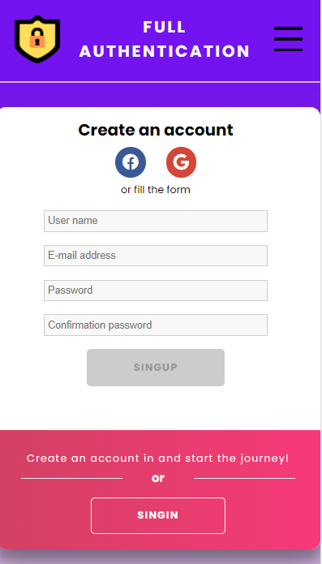
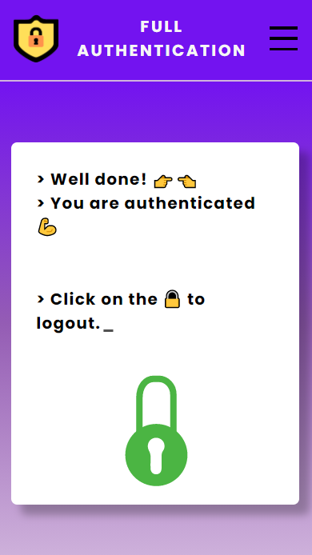

<h1>Authentication application </h1>

<h2>👀 Shots 👀</h2> 

    
    
    
    

<i>Above screenshots comes from <strong>mobile</strong> view of app<i>

<h2>🧻 Descriptions 🧻</h2>

Applications allows to perform some basic actions associated with authentication and partly with authorization.

The main aim of the project creation was to posses/develop skills connceted with web development. 

**[API](https://github.com/wawrzynmc/Authentication-server)** used in project is also designed on my own.

The project is not inspired by any existing project and has been fully done by myself 😇.

> <h3>🦾 Functionalities 🦾</h3>
> 
> - **account creation/registration**
> 
>   - standard way or using OAuth2 with itegration with Google and Facebook
> 
> - **account activation**
>
>   - with email verification
>   - inactive accounts are deleted by one of the CRON actions with certain frequency
> 
> - **logging in**
> 
>   - standard way or using OAuth2 with itegration with Google and Facebook
> 
> - **authorization**
> 
>   - distinguish between admin/user role and show specific views/navlinks based on it
> 
> - **password reset**
> 
>   - with email verification
> 
> - **multilang application** (🇬🇧/🇵🇱)
> 
> - **responsive design** (mobile first)
> 
> - **additionals**
> 
>   - own form validation logic

<h2>🧰 Tools 🧰</h2>

- **library**: React (functional components, hooks. ContextAPI)
- **styling**: CSS Modules with Sass
- **multilang support**: i18next
- **hosting**: Heroku

<h2>🏃‍♂️ How to deal with 🏃‍♂️</h2>

- <code>npm install</code> - installs all deps
- <code>npm start</code> - runs app in dev mode
- ~~<code>npm run test</code>~~ - runs tests

<h2>💩 Check it 💩</h2>
https://wawrzynmc-authentication-app.web.app/
